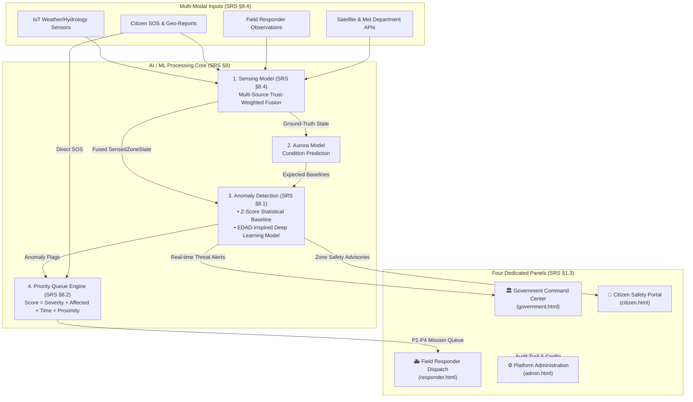

<<<<<<< HEAD
# RAKSHASETU (रक्षासेतु)
## Disaster Preparedness & Emergency Response Platform
**Consolidated Software Specification & Implementation Guide (Version 2.0)**  
*Scope: Government Command Center · Citizen Safety Portal · Field Responder Dispatch · System Admin*

---

## 📑 Table of Contents
1. [Platform Overview](#platform-overview)
2. [Included AI / ML Models (SRS Section 8)](#included-ai--ml-models-srs-section-8)
3. [The 4 Operational Panels](#the-4-operational-panels)
4. [System Architecture & Data Flow](#system-architecture--data-flow)
5. [Research & Anomaly Detection Pipeline](#research--anomaly-detection-pipeline)
6. [Quick Start & Execution Guide](#quick-start--execution-guide)
7. [Directory Structure](#directory-structure)

---

## 1. Platform Overview

**RakshaSetu** is a multi-tier disaster management and emergency response ecosystem built to handle rapid disaster lifecycles (early warning, real-time multi-modal sensing, verified dispatch, and coordinated relief). 

The platform separates operational responsibilities across four dedicated panels backed by an event-driven microservices architecture and an integrated AI/ML sensing and anomaly detection layer.



---

## 2. Included AI / ML Models (SRS Section 8)

| Model Name | SRS Reference | Architecture / Implementation | Status | Artifact / File Path |
| :--- | :--- | :--- | :--- | :--- |
| **Z-Score Statistical Detector** | **SRS §8.1.1** | Per-node Gaussian deviation ($\mu, \sigma$) across 8 environmental metrics; thresholds 2.0, 2.5, 3.0 | **Included & Calibrated** | [`rakshasetu-research/models/zscore_baseline.json`](file:///c:/Users/priti/OneDrive/Desktop/rakshasetu%20model/Rakshasetu/rakshasetu-research/models/zscore_baseline.json) |
| **EDAD-Inspired Deep Learning Model** | **SRS §8.1.2** | 1D-CNN + Bidirectional GRU with dual decomposition (Trend $Z_s$ + Auxiliary $Z_a$), InfoNCE temporal contrastive head, squared MI penalty guard | **Included & Trained (15 Epochs)** | [`rakshasetu-research/models/edad_best.pt`](file:///c:/Users/priti/OneDrive/Desktop/rakshasetu%20model/Rakshasetu/rakshasetu-research/models/edad_best.pt) |
| **Aurora Condition Forecasting Model** | **SRS §8 (Flow)** | Seq2Seq 1D-CNN + Bidirectional GRU with Temporal Attention (1-hr ahead forecast over 8 channels) | **Included & Trained** | [`rakshasetu-research/models/aurora_best.pt`](file:///c:/Users/priti/OneDrive/Desktop/rakshasetu%20model/Rakshasetu/rakshasetu-research/models/aurora_best.pt) |
| **Multi-Source Sensing Model** | **SRS §8.4** | Trust-weighted fusion engine (`fused_value = Σ(v_i * w_i) / Σ(w_i)`); produces structured `SensedZoneState` | **Included (Spec & Logic)** | [`Sensing_Model_Documentation.md`](file:///c:/Users/priti/OneDrive/Desktop/rakshasetu%20model/Rakshasetu/README.md#included-ai--ml-models-srs-section-8) |
| **Priority Queue Scoring Engine** | **SRS §8.2** | Multi-factor weighted score: `Severity + People Affected + Distance + Time Sensitivity + Available Resources` | **Included in Field Responder Logic** | [`responder.html`](file:///c:/Users/priti/OneDrive/Desktop/rakshasetu%20model/Rakshasetu/responder.html) |
| **Multilingual Chatbot / NLU** | **SRS §8.3** | Citizen disaster guidance, shelter lookups, and reporting assistance with language translation fallback | **Included in Citizen Safety App** | [`citizen.html`](file:///c:/Users/priti/OneDrive/Desktop/rakshasetu%20model/Rakshasetu/citizen.html) |

---

## 3. The 4 Operational Panels

All 4 panels are fully functional, responsive, and cross-linked with instantaneous portal switching:

### 1. 🏛️ Government Panel (`government.html`)
- **Role:** High-level command center, multi-agency coordination, budget and resource allocation.
- **Key Features:** Live incident map with danger zones, resource allocation KPIs, department readiness matrix, inter-agency broadcast alert triggers.
- **Live Local URL:** [http://localhost:8000/government.html](http://localhost:8000/government.html)

### 2. 👥 Citizen Panel (`citizen.html`)
- **Role:** Direct public emergency interface and family safety monitor.
- **Key Features:** One-tap SOS beacon with automated geolocation, report submission with photo proof, safe route evacuation navigator, family safety check-in, multilingual guidance chatbot.
- **Live Local URL:** [http://localhost:8000/citizen.html](http://localhost:8000/citizen.html)

### 3. 🚑 Field Responder Panel (`responder.html`)
- **Role:** Field operations, mission execution, and on-site tactical triage.
- **Key Features:** P1–P4 Priority Queue consumption, incident verification modal, live team telemetry, navigation avoiding hazard zones, on-site photo upload, mission escalation.
- **Live Local URL:** [http://localhost:8000/responder.html](http://localhost:8000/responder.html)

### 4. ⚙️ Admin Panel (`admin.html`)
- **Role:** Governance, platform security, and audit enforcement.
- **Key Features:** RBAC role management, immutable audit logging, on-demand and scheduled disaster backup & recovery workflows, system health monitoring.
- **Live Local URL:** [http://localhost:8000/admin.html](http://localhost:8000/admin.html)

### 🌐 Main Hub (`index.html`)
- Central portal selector connecting all modules: [http://localhost:8000/index.html](http://localhost:8000/index.html)

---

## 4. System Architecture & Data Flow

### Event-Driven Kafka Topics (SRS §7.2)
- `incident.created` $\to$ Consumed by Sensing Service, AI/Anomaly Service, Government
- `sensing.fused` $\to$ Emitted by Sensing Model; feeds Anomaly Detection & Aurora
- `anomaly.detected` $\to$ Dispatches priority alerts to Government and Field Responders
- `mission.assigned` $\to$ Notifies assigned Field Responder team
- `audit.event` $\to$ Immutable record stored by Admin Audit Service

### Core Data Entities (SRS Section 5)
- `User` / `Role` (RBAC)
- `Incident` (State machine: Unverified $\to$ Verified $\to$ Resolved)
- `SensedZoneState` (Zone ID, metric, fused value, confidence score, source weights)
- `Mission` (Incident link, assigned team, priority score, resources, deadline)
- `Resource` (Boats, medical kits, rescue drones, vehicles)
- `AuditLog` & `BackupRecord`

---

## 5. Research & Anomaly Detection Pipeline

Located in the [`rakshasetu-research/`](file:///c:/indoreproject/innovik.frontend.aditi/rakshasetu-research/) subproject.

### Dataset & Benchmark Classification
- **Dataset:** `springbrook_wsn_synthetic_100k.csv` (100,000 samples, 20 sensor nodes `SB-001`..`SB-020`, 10-min cadence).
- **Classification:** **Synthetic Anomaly Benchmark**.
- **Environmental Features (8):** `air_temperature_C`, `relative_humidity_pct`, `air_pressure_hPa`, `wind_speed_ms`, `wind_direction_deg`, `leaf_wetness_pct`, `soil_moisture_pct`, `solar_radiation_Wm2`.
- **Excluded Feature:** `battery_voltage_V` (reserved strictly for device health QA).

### Benchmark Results (Test Split: 14,790 Windows)

| Metric | Z-Score Baseline (SRS §8.1.1) | EDAD-Inspired Model (SRS §8.1.2) |
| :--- | :--- | :--- |
| **Flag Rate (Threshold 2.5σ)** | 41.09% (6,077 windows) | 2.04% (301 windows) |
| **Mean Anomaly Burst Duration** | 15.87 windows (~2.6 hours) | 1.72 windows (~17 minutes) |
| **Model Agreement (Jaccard Index)** | `0.0384` (60.07% overall normal/anomalous concordance) | — |
| **Controlled Spike Sanity Check (+5σ)** | **100.0%** (591/591 detected) | **83.42%** (493/591 detected) |
| **Inference Throughput** | 1,152,183 windows/sec | 37,237 windows/sec |
| **Trainable Parameters** | 0 | 124,936 |

Detailed findings are documented in [`results/reports/final_model_comparison.md`](file:///c:/indoreproject/innovik.frontend.aditi/rakshasetu-research/results/reports/final_model_comparison.md).

---

## 6. Quick Start & Execution Guide

### 1. Launch Frontend Application
```powershell
# In project root:
python -m http.server 8000
```
Then navigate to `http://localhost:8000/index.html` or `http://localhost:8000/admin.html`.

### 2. Run the Machine Learning Pipeline
```powershell
# Navigate to research folder:
cd rakshasetu-research

# Run entire pipeline end-to-end (Inspection -> Preprocess -> Baseline -> Train -> Eval -> Report):
python run_all.py
```

Or run individual pipeline stages:
```powershell
python src/data_loader.py       # Step 0: Data inspection & schema verification
python src/preprocess.py        # Step 1: Per-node 70/15/15 chronological split & scaling
python src/zscore_baseline.py   # Step 2: Fit & save Z-Score statistical baseline
python src/train_edad.py        # Step 3: Train EDAD deep learning model with checkpointing
python src/evaluate.py          # Step 4: Unsupervised comparative evaluation & figures
python src/generate_report.py   # Step 5: Final markdown report generation
```

---

## 7. Directory Structure

```
c:/indoreproject/innovik.frontend.aditi/
├── index.html                          # ResQNet / RakshaSetu All-Panels Landing Hub
├── government.html                     # 1. Government Command Center Panel
├── citizen.html                        # 2. Citizen Emergency Services Portal
├── responder.html                      # 3. Field Responder Operations Dashboard
├── admin.html                          # 4. System Administration & RBAC Portal
├── README.md                           # Master documentation (this file)
└── rakshasetu-research/                # AI/ML Anomaly Detection Research Subsystem
    ├── config/
    │   └── config.yaml                 # Pipeline hyperparams, schema & feature definitions
    ├── data/
    │   ├── raw/
    │   │   └── springbrook_wsn_synthetic_100k.csv  # 100k row benchmark dataset
    │   └── processed/
    │       ├── train.csv               # Per-node chronological 70% split
    │       ├── validation.csv          # Per-node chronological 15% split
    │       ├── test.csv                # Per-node chronological 15% split
    │       └── preprocessing_metadata.json
    ├── models/
    │   ├── zscore_baseline.json        # SRS §8.1.1 statistical baseline parameters
    │   └── edad_best.pt                # SRS §8.1.2 trained PyTorch checkpoint
    ├── results/
    │   ├── figures/                    # Generated charts (distributions, agreement, timeline)
    │   └── reports/
    │       ├── data_inspection.json    # Initial data inspection report
    │       ├── edad_training_log.json  # 15-epoch training loss curves
    │       ├── unsupervised_evaluation.json # Metrics & top-20 anomalous windows
    │       └── final_model_comparison.md    # Comprehensive markdown research report
    ├── src/
    │   ├── data_loader.py              # Data inspection & verification
    │   ├── preprocessing.py            # Per-node imputation & StandardScaler
    │   ├── feature_engineering.py      # Per-node sliding windows (eta=12, stride=1)
    │   ├── zscore_baseline.py          # SRS §8.1.1 baseline detector
    │   ├── edad_model.py               # Encode-then-Decompose architecture
    │   ├── train.py                    # PyTorch AdamW training loop with MI penalty guard
    │   ├── train_edad.py               # Step 3 runner entrypoint
    │   ├── evaluate.py                 # Unsupervised evaluation & synthetic sanity injection
    │   ├── generate_report.py          # Step 5 report generator
    │   └── utils.py                    # Reproducibility (seed=42), timing, device detection
    ├── requirements.txt                # Python dependencies
    ├── run_all.py                      # Master pipeline runner
    └── README.md                       # Research subproject README
```
=======
# Innovik-6.0
>>>>>>> origin/main
